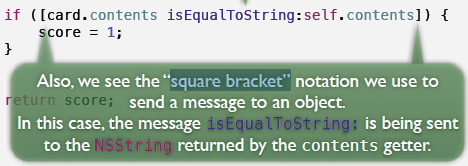
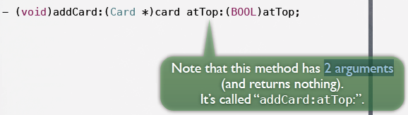
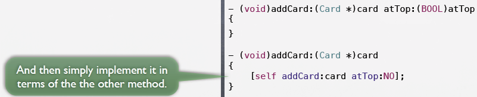
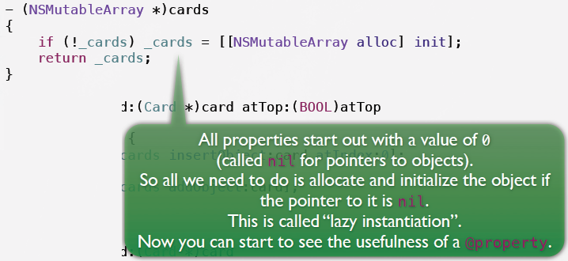
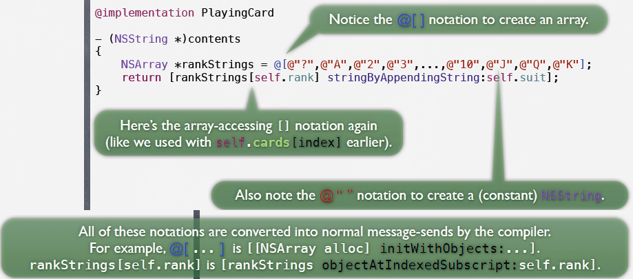
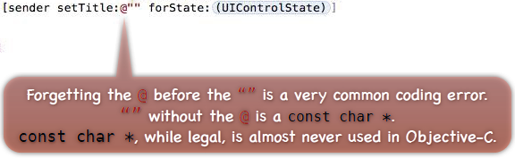
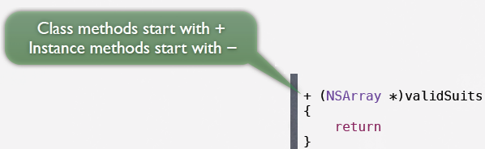
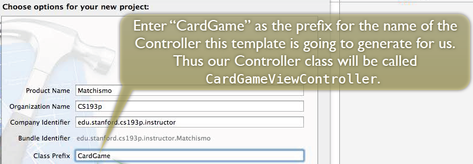
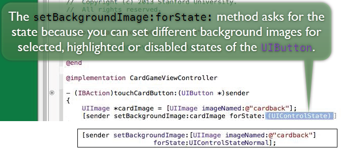

<link href="http://github.com/yrgoldteeth/darkdowncss/raw/master/darkdown.css"rel="stylesheet"></link>

# Developing Applications for iOS #
*Stanford CS193p (Fall 2013-14)*

## Lecture 1 ##
*Sep. 23th,2013*

###1. ios ###

###2. mvc ###

###3. Objective-C ###
- Card.h Public Declarations
- Card.m Private Implementation

> \#import <Foundation/Foundation.h\>
> 
> @import Foundation
> 
> In iOS 7 (only), there is special syntax for importing an entire framework called @import.

#### property ####

#### strong ####

#### nonatomic ####

#### synthesize ####

#### BOOL getter ####

#### method ####

#### square bracket ####

> Only to use dot in setter and getter
> 
> Here, the message isEqualToString method is sent to NSString

## Lecture 2 ##
*Sep. 25th, 2013*

###1. Objective-C ###

#### more arguments ####

#### overload ####

#### NSMutableArray alloc ####

#### @ notation ####

#### class method ####

###2. XCode5 ###

#### class prefix ####

#### forState ####

**[Index](readme.md)**