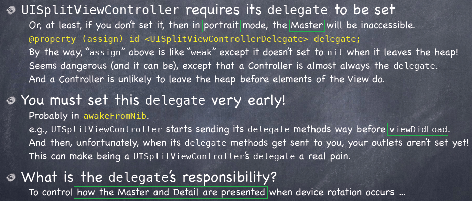

<link href="http://github.com/yrgoldteeth/darkdowncss/raw/master/darkdown.css"rel="stylesheet"></link>

# Developing Applications for iOS #
*Stanford CS193p (Fall 2013-14)*

## Lecture 10 ##
*Oct. 28th,2013*

### Multithreading ###
#### Queues ####

#### Example ####

### UIScrollView ###
Adding subviews to a normal UIView ...

	subview.frame = ...;
	[view addSubview:subview];

Adding subviews to a UIScrollView ...

	scrollView.contentSize = CGSizeMake(3000, 2000);
	subview1.frame = CGRectMake(2700, 100, 120, 180);
	[view addSubview:subview1];

Visible area of a scroll view’s subview in that view’s coordinates

	CGRect visibleRect = [scrollView convertRect:scrollView.bounds toView:subview];

What’s the difference? Might be scaled (due to zooming), for example.

### Imaginarium(demo) ###

#### Scroll ####

#### Zoom ####

#### asyc thread ####

## Lecture 11 ##
*Oct. 30th,2013*

### UITableView ###

#### UITableView Protocols ####

#### UITableViewDataSource ####

#### UITableViewDelegate ####

#### UITableView Segue ####

#### UITableView Spinner ####

### iPad ###
#### Universal Applications ####

#### UISplitViewController ####

#### UISplitViewControllerDelegate ####

#### Popovers ####

### Shutterbug(demo) ###

**[Index](readme.md)**