<link href="http://github.com/yrgoldteeth/darkdowncss/raw/master/darkdown.css"rel="stylesheet"></link>

# Developing Applications for iOS #
*Stanford CS193p (Fall 2013-14)*

## Lecture 12 ##
*Nov. 4th,2013*
### Core Data ###
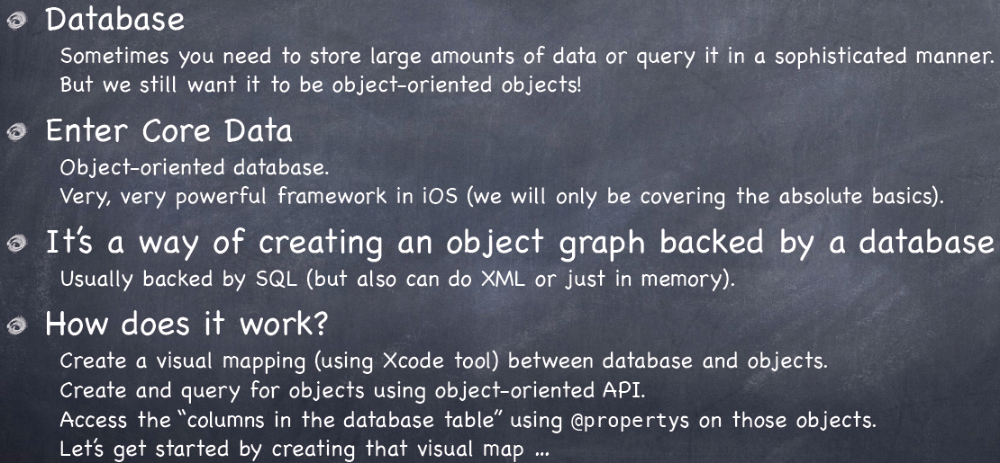

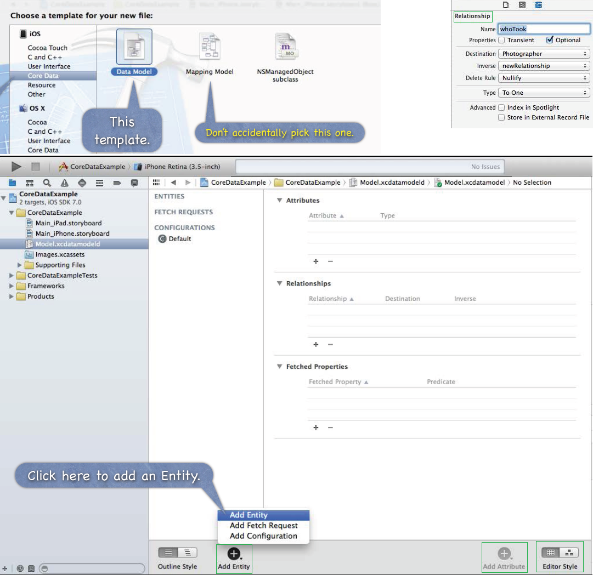

#### NSManagedObjectContext ####
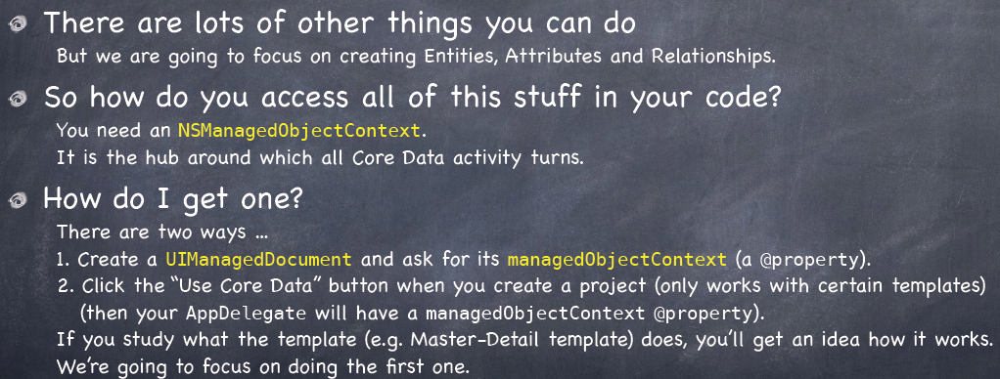

#### UIManagedDocument ####
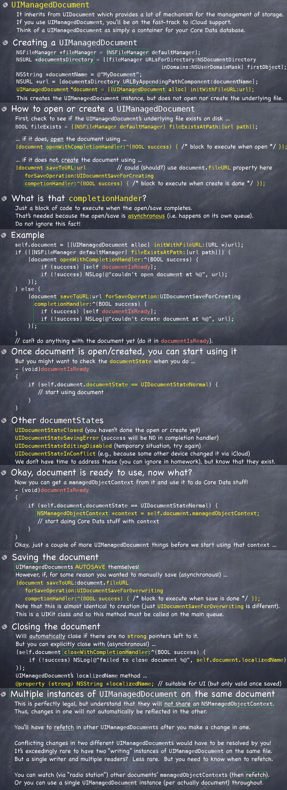

#### NSNotification ####
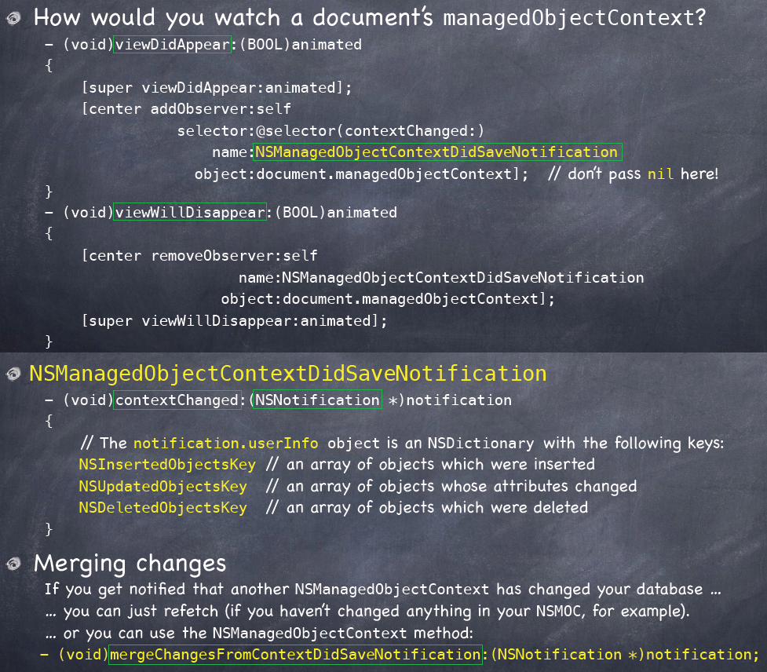

#### Access ####
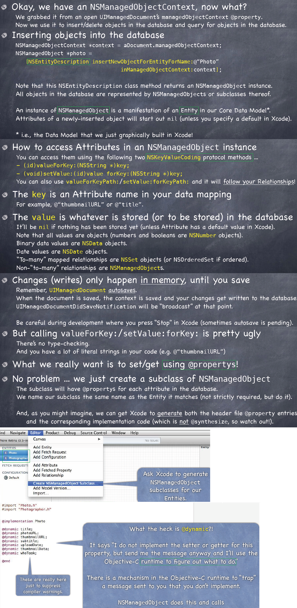

#### Categories ####
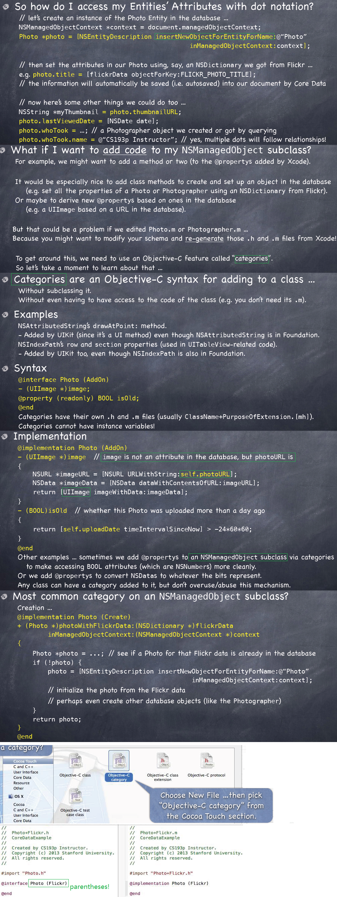

#### Deletion ####
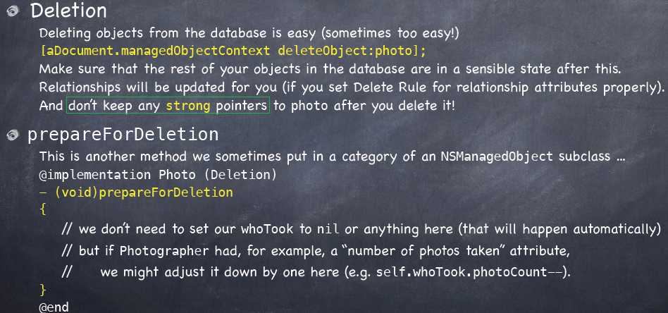

#### Querying ####
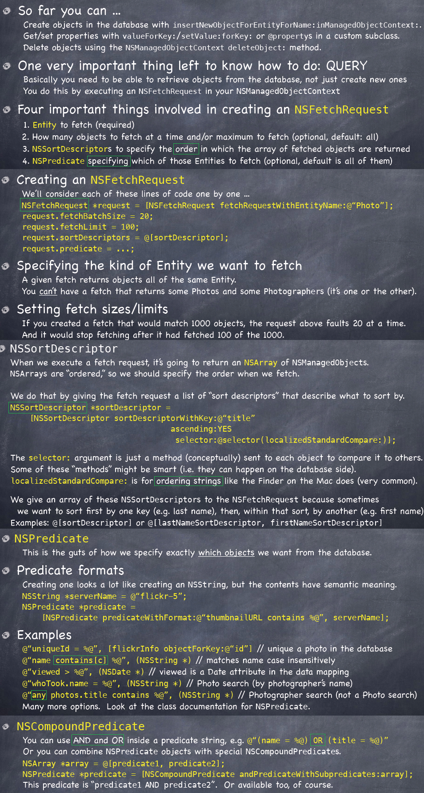

#### Advanced Querying ####

####Core Data Thread Safety####
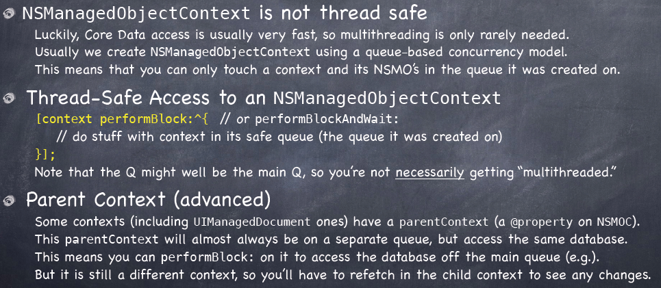

## Lecture 13 ##
*Nov. 6th,2013*

###Core Data and UITableView###
#### NSFetchedResultsController ####
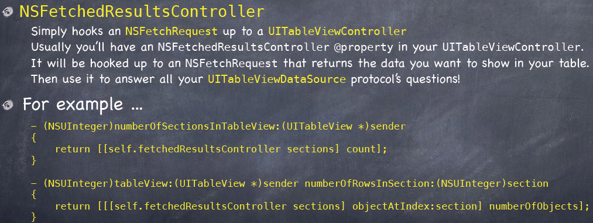

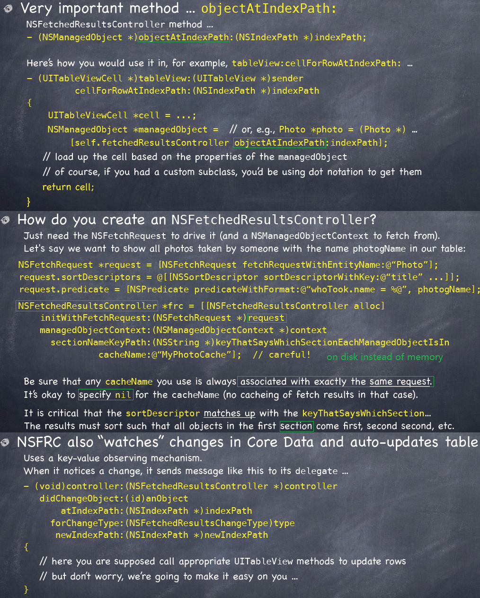

#### CoreDataTableViewController ####
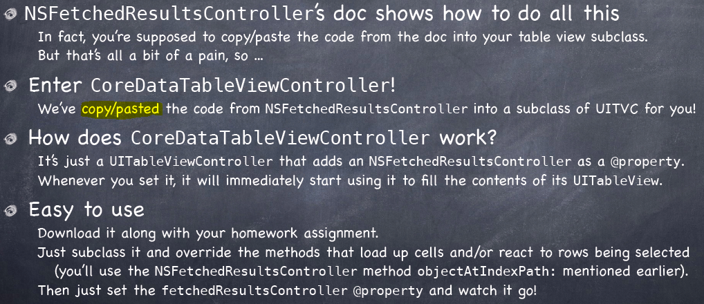

### Photomania ###
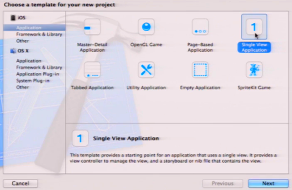
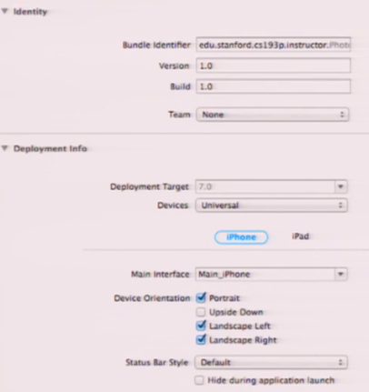
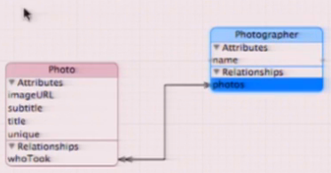
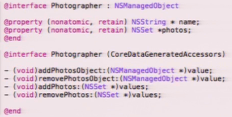
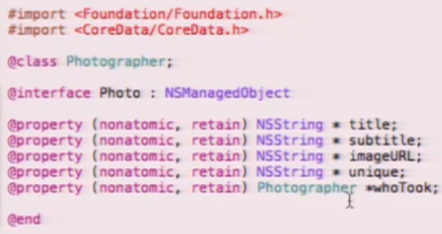

**[Index](readme.md)**