<link href="http://github.com/yrgoldteeth/darkdowncss/raw/master/darkdown.css"rel="stylesheet"></link>

# Developing Applications for iOS #
*Stanford CS193p (Fall 2013-14)*

## Lecture 14 ##
*Nov. 11th,2013*
### UIApplication ###
There is a shared instance of a UIApplication object in your application.

This is different from your Application Delegate (the thing that handles all those message from iOS).
You almost never need it, but it can give you some interesting (very global) information.

UIApplication *myApplication = [UIApplication sharedApplication];

Check out its documentation.

### Network Activity Indicator ###
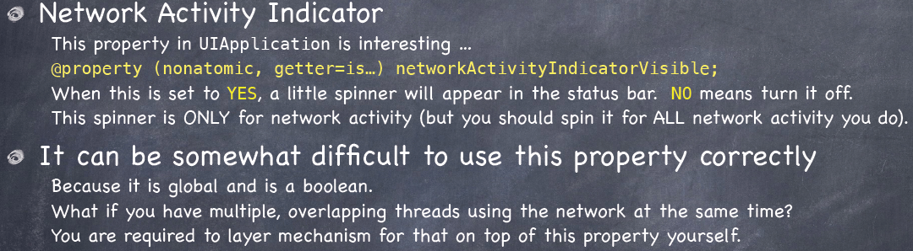

###Demo Followup -- Photomania###
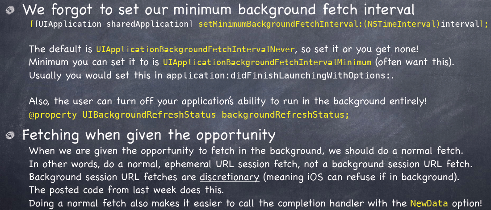
### Maps ###
#### Core Location ####

## Lecture 15 ##
*Nov. 13th,2013*

### MapKit ###
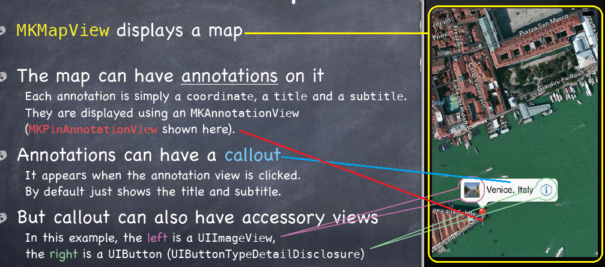
#### MKMapView ####
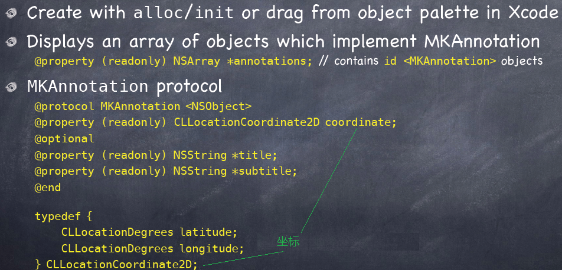

#### MKAnnotation ####
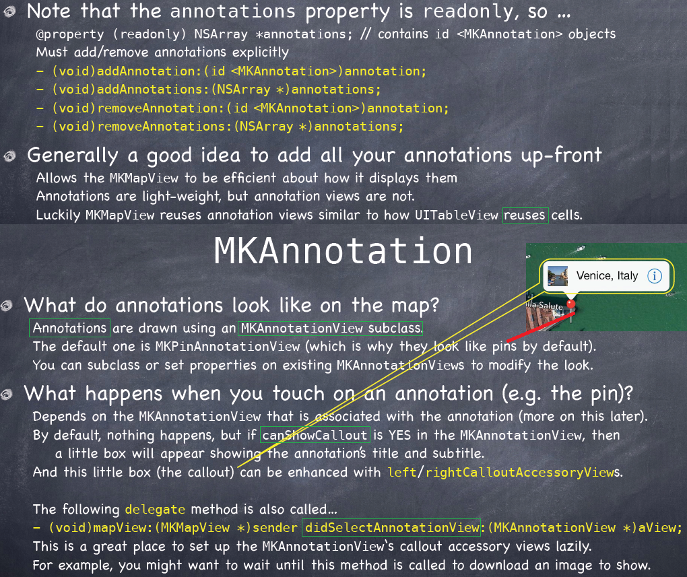
#### MKAnnotationView ####
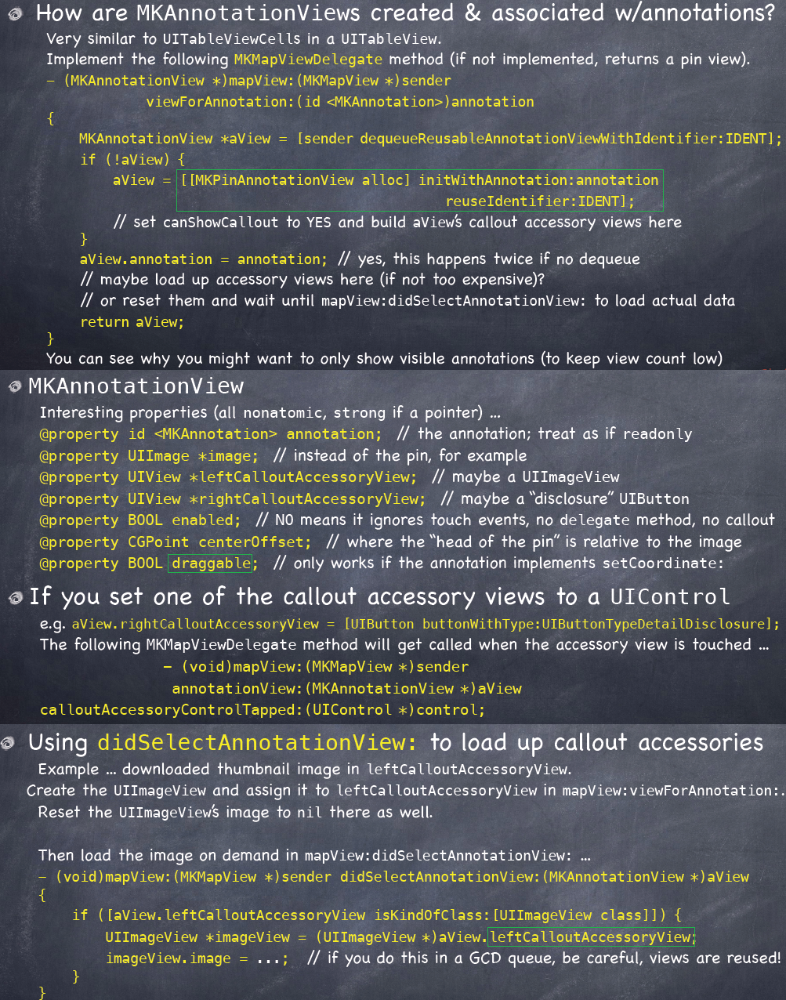
#### MKMapView ####
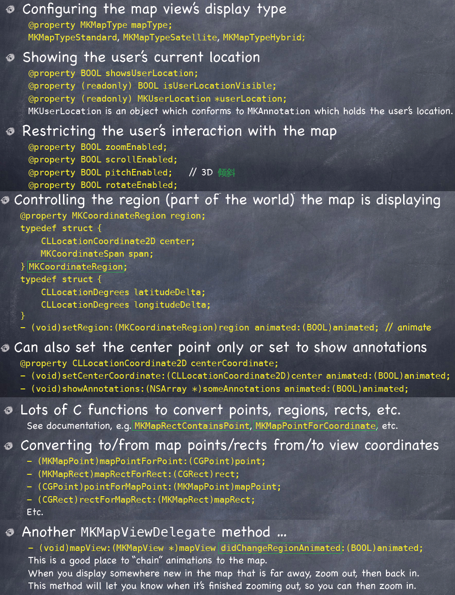
#### MKMapCamera ####
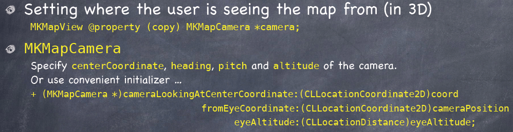
#### MKLocalSearch ####
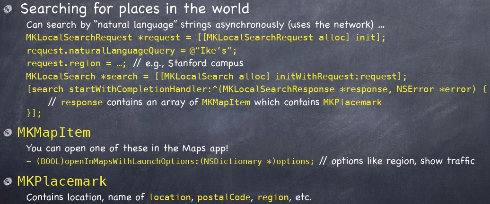
#### MKDirections ####
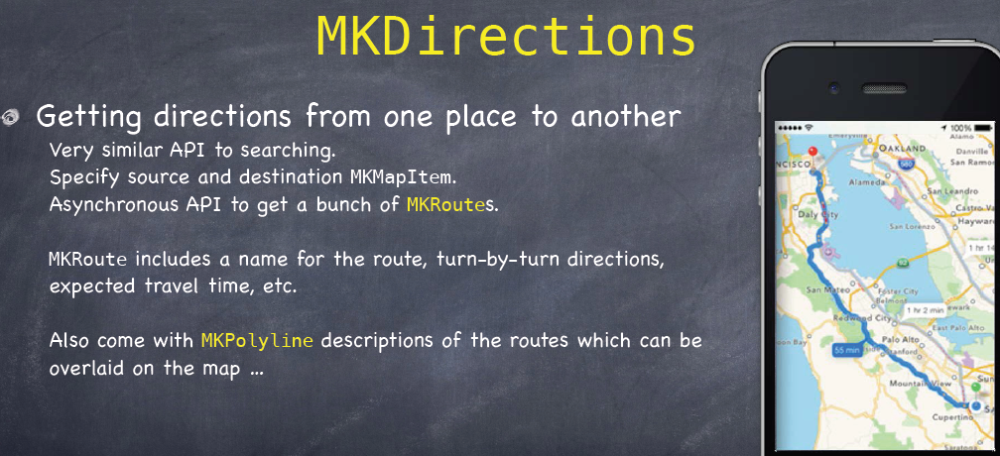
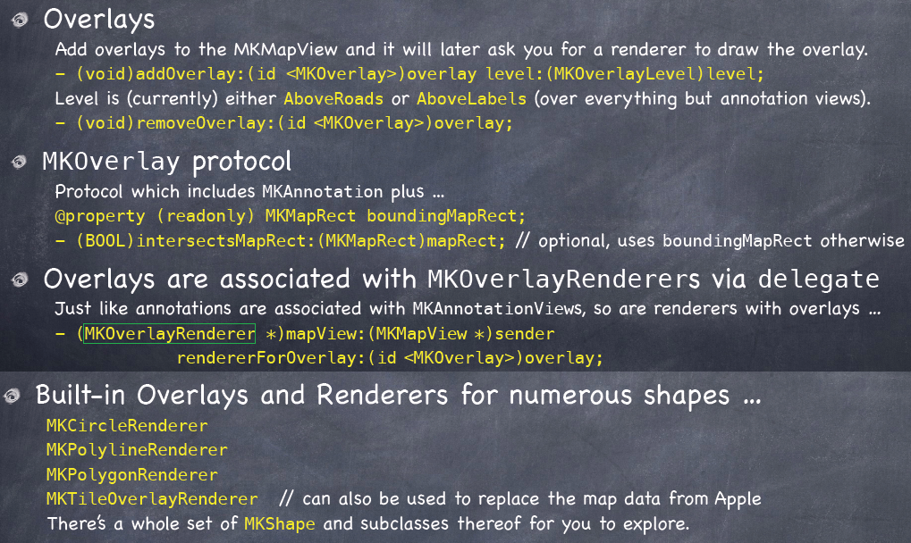

### Embed Segue ###
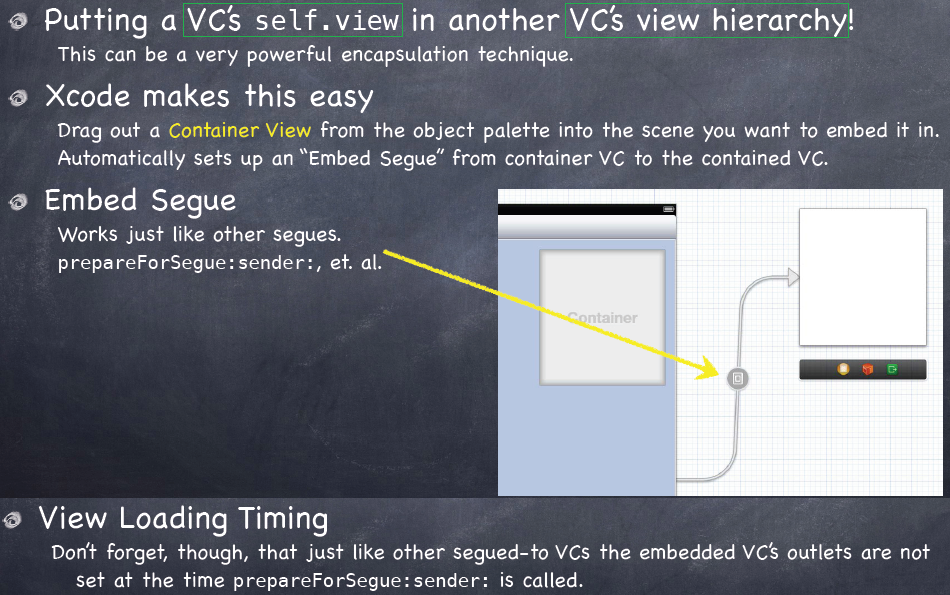

### Photomania Map Demo ###
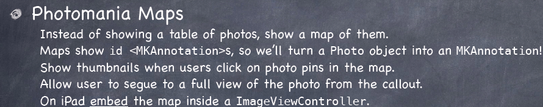

**[Index](readme.md)**