<link href="http://github.com/yrgoldteeth/darkdowncss/raw/master/darkdown.css"rel="stylesheet"></link>

# Developing Applications for iOS #
*Stanford CS193p (Fall 2013-14)*

## Lecture 3 ##
*Sep. 30th,2013*
### review ###
#### mvc ####
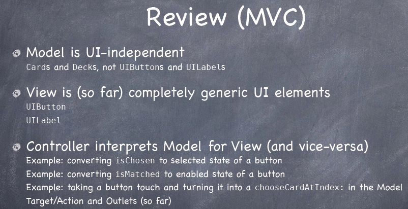
#### xcode5 ####
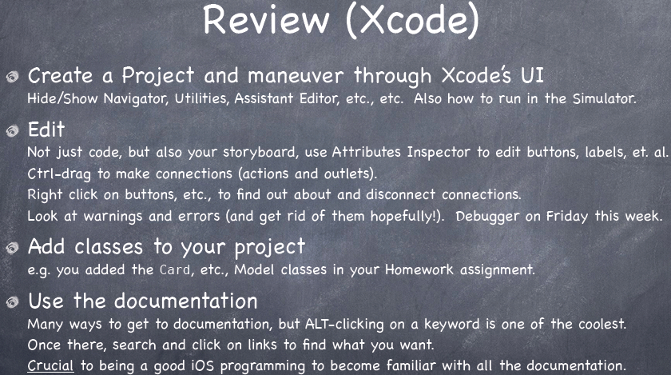
#### oopc ####
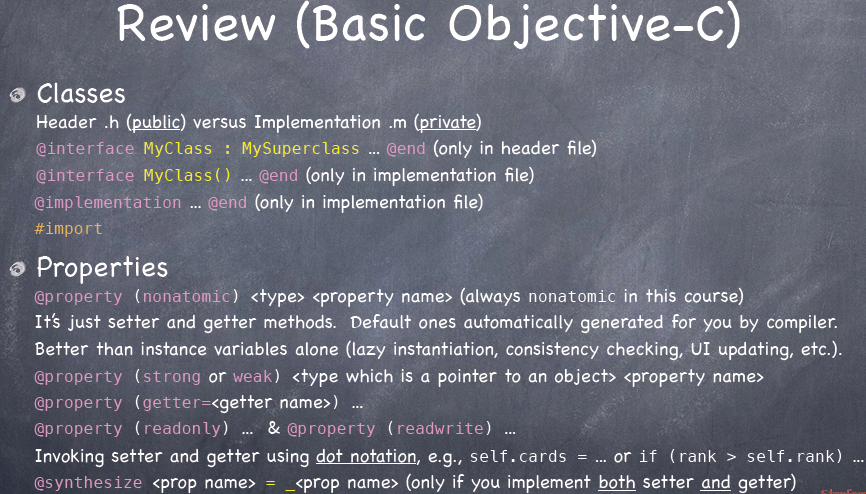
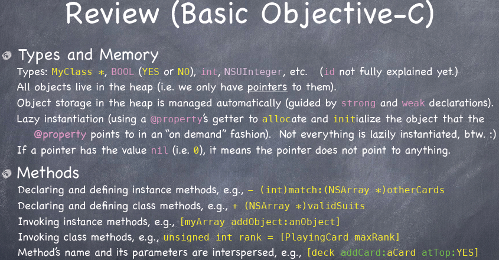
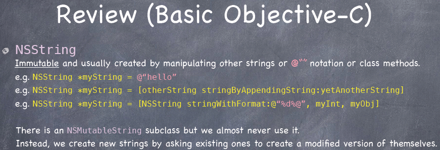
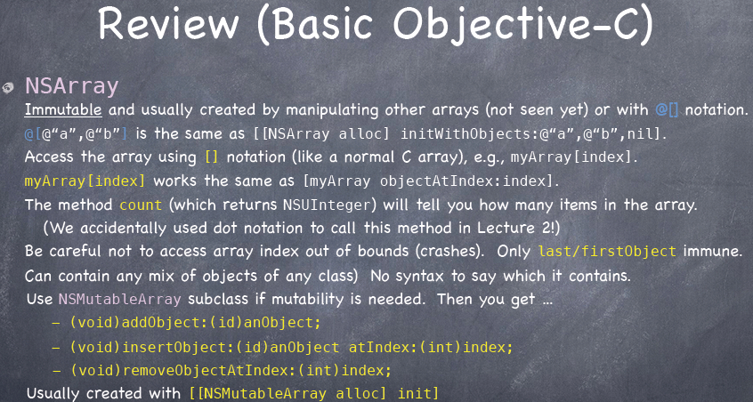
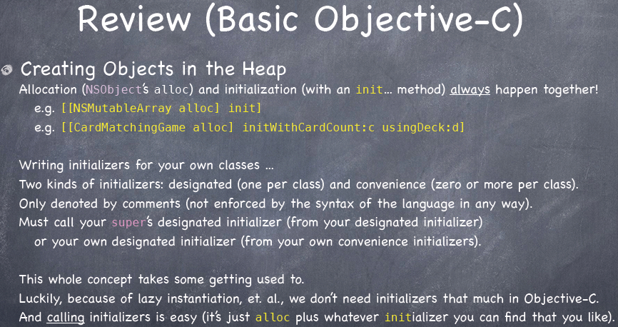
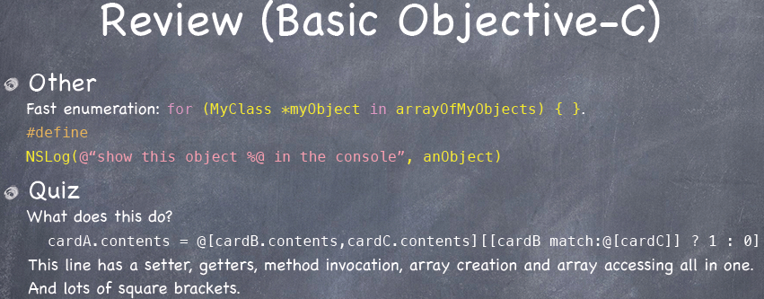

### Matchismo ###
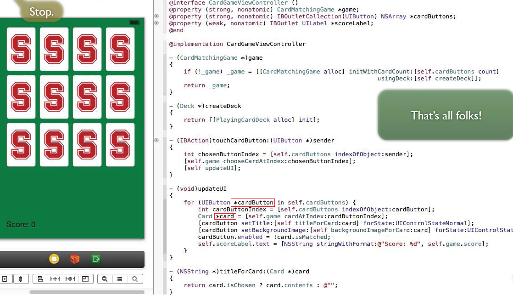

## Lecture 4 ##
*Oct. 2nd,2013*
 
### Creating Objects ###
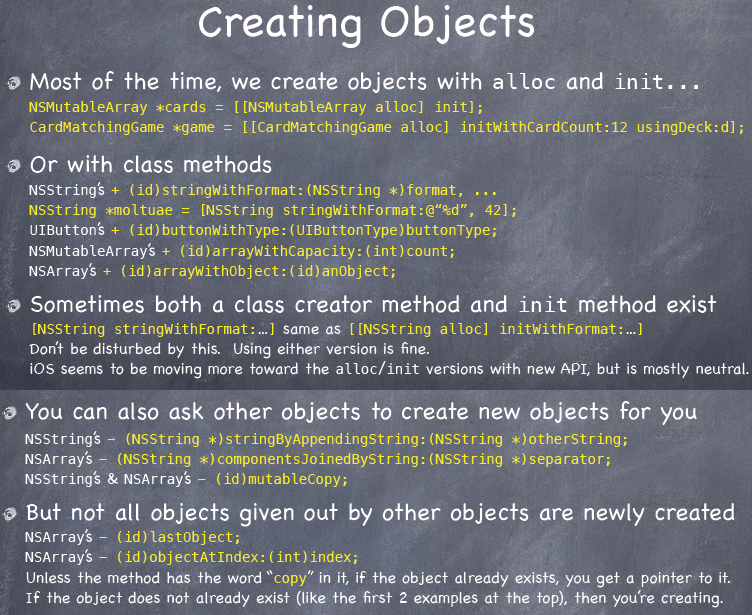
### nil ###
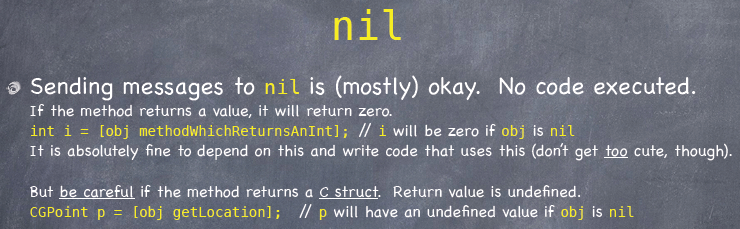

### Dynamic Binding ###
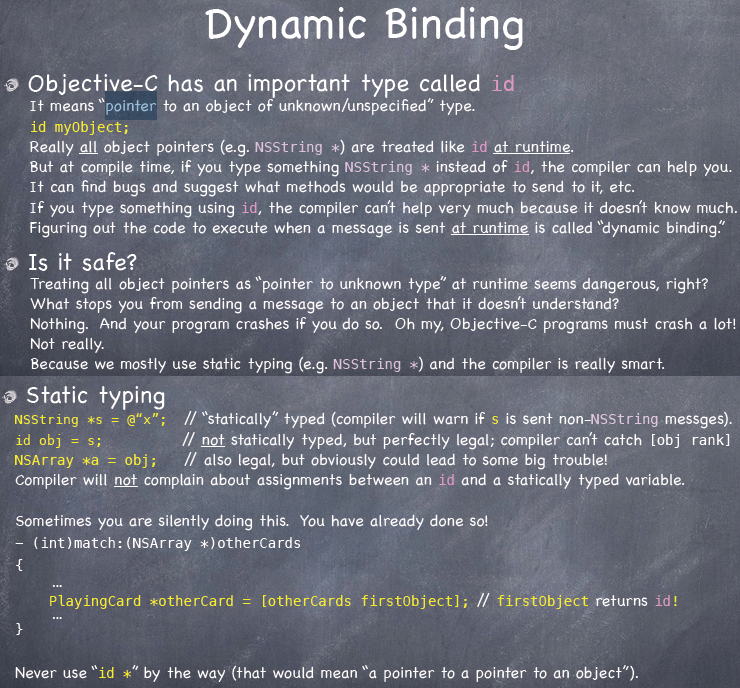

#### Object Typing ####
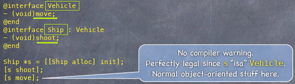
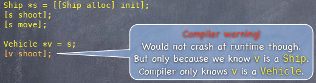
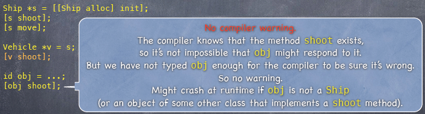
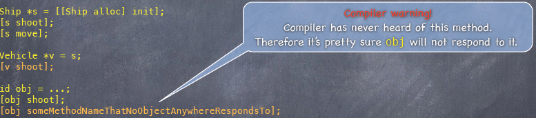
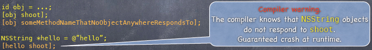
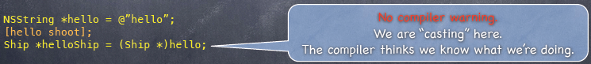
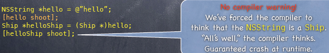

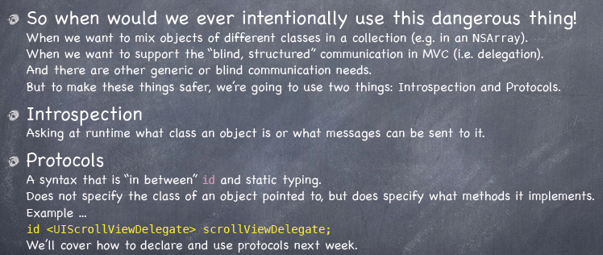
> Introspection 自省

### Introspection ###
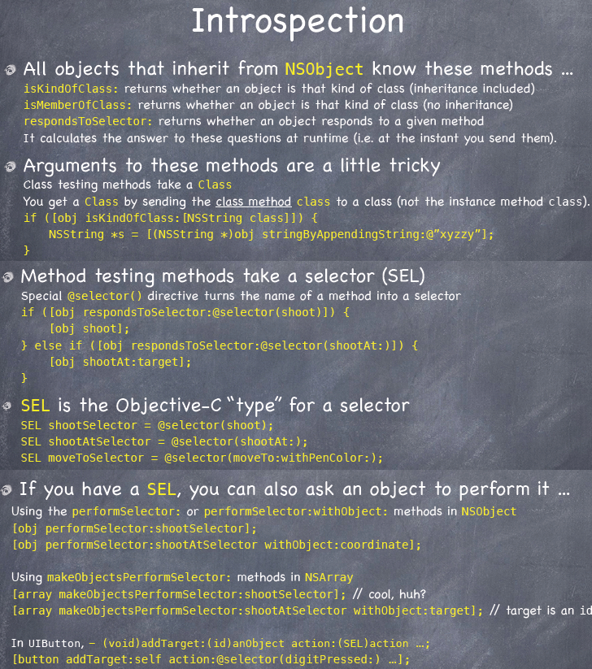

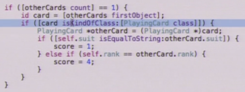

###Foundation Framework###
#### NSObject ####
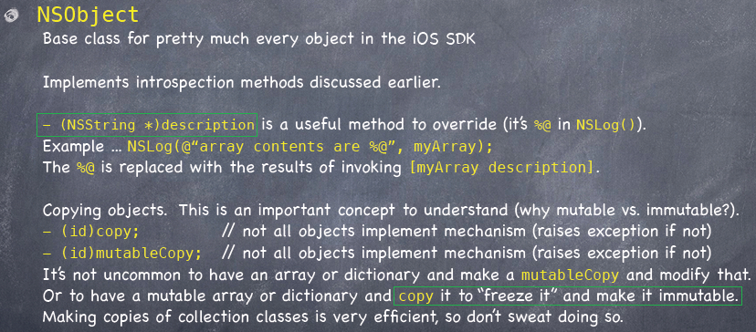
#### NSArray ####
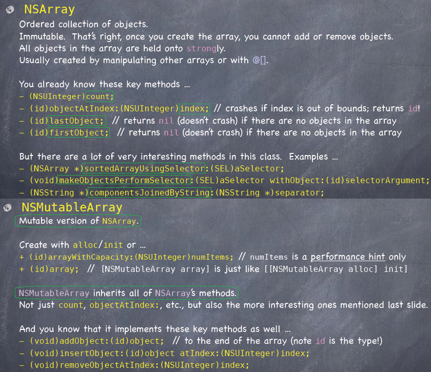
#### NSNumber ####
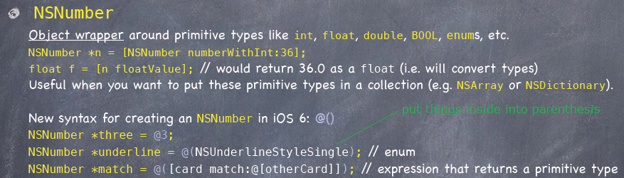
#### NSValue ####
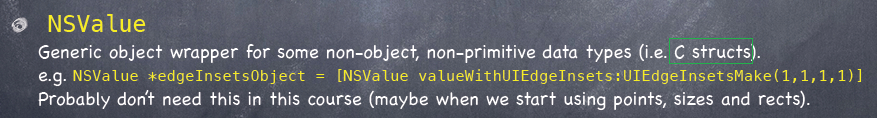
#### NS…… ####
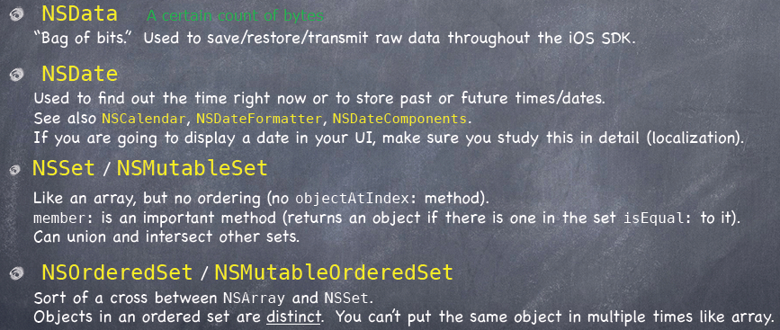
#### NSDictionary ####
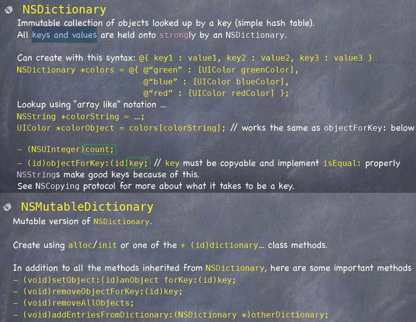
###Enumeration###
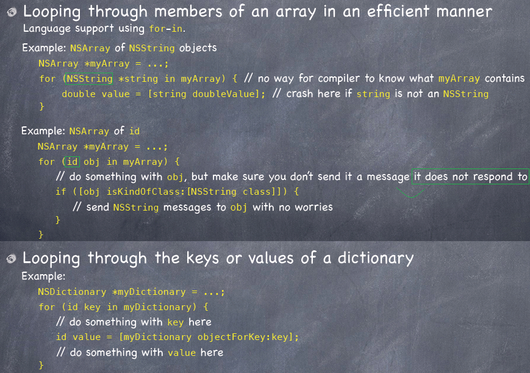
#### Property List ####
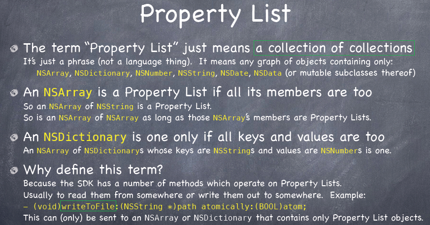
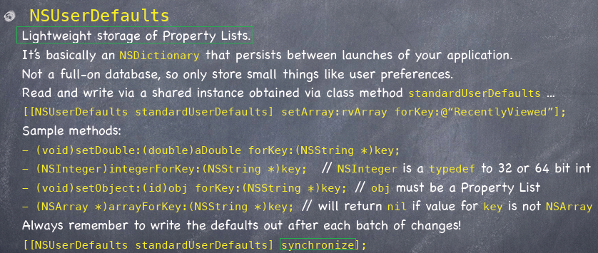
#### NSRange ####
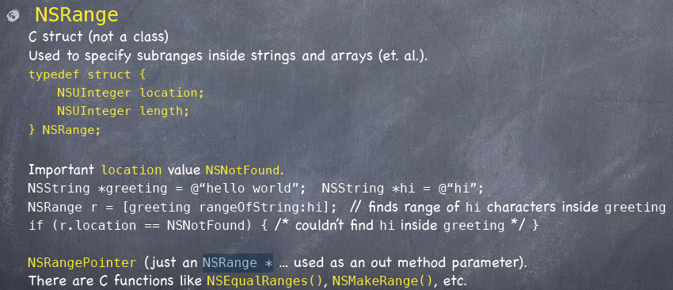

#### Attributed Strings ####
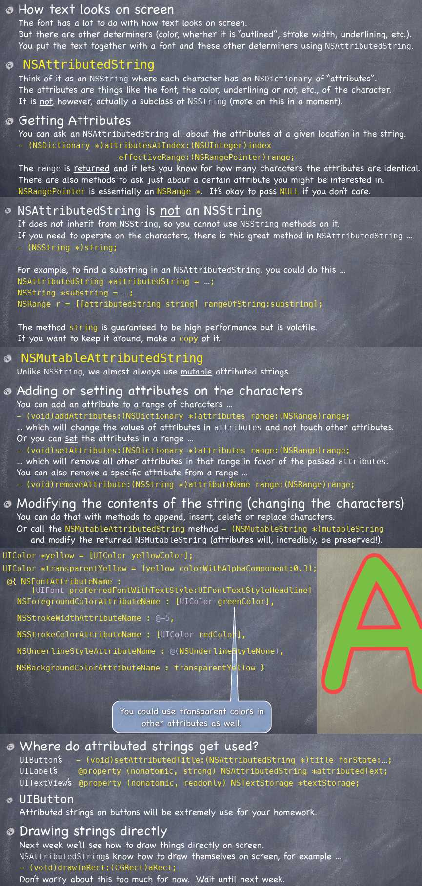

**[Index](img/3-4/readme.md)**