<link href="http://github.com/yrgoldteeth/darkdowncss/raw/master/darkdown.css"rel="stylesheet"></link>

# Developing Applications for iOS #
*Stanford CS193p (Fall 2013-14)*

## Lecture 3 ##
*Sep. 30th,2013*
### review ###
#### mvc ####
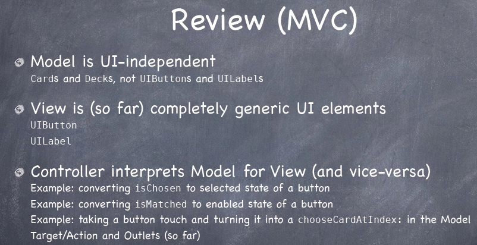
#### xcode5 ####

#### oopc ####
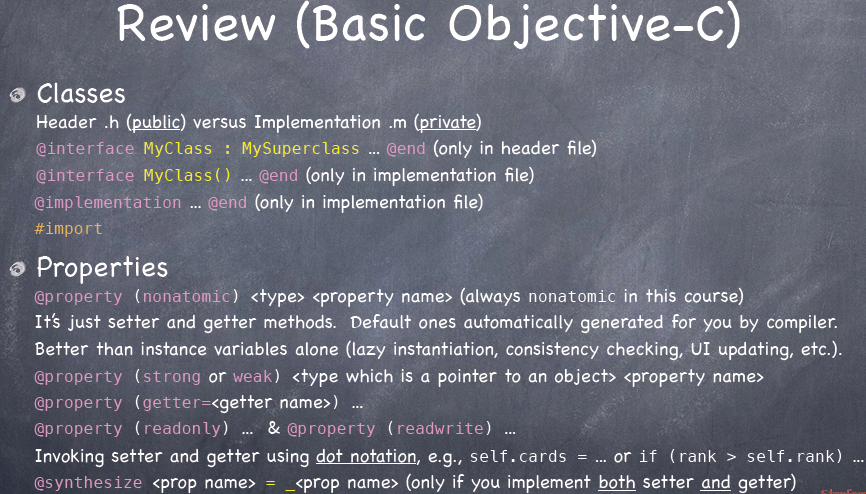
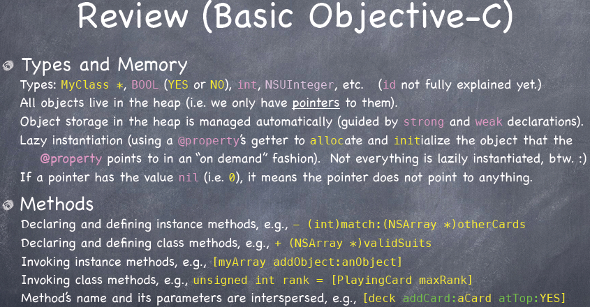
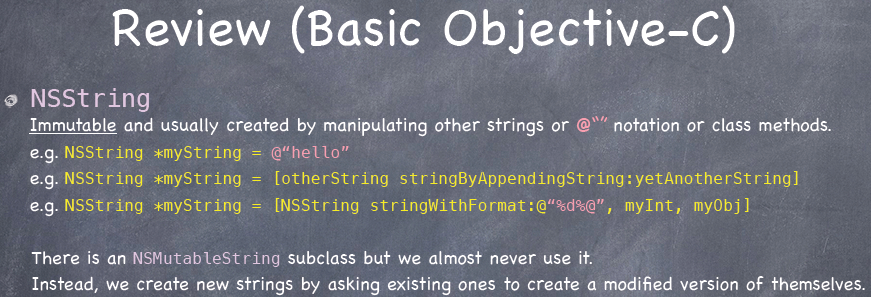
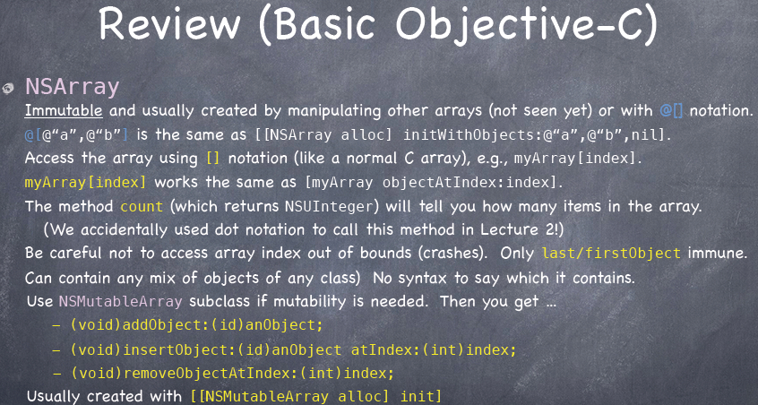
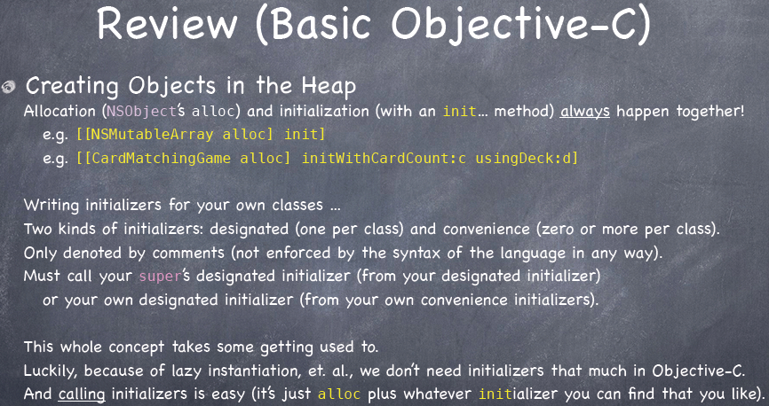
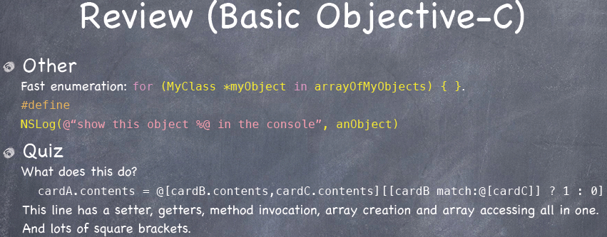

### Matchismo ###
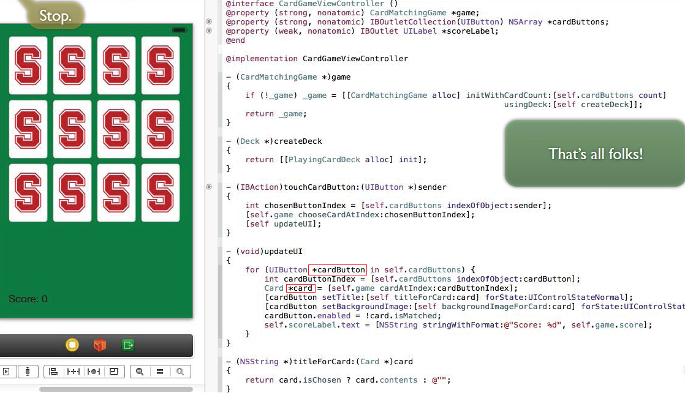

## Lecture 4 ##
*Oct. 2nd,2013*
 
### Creating Objects ###
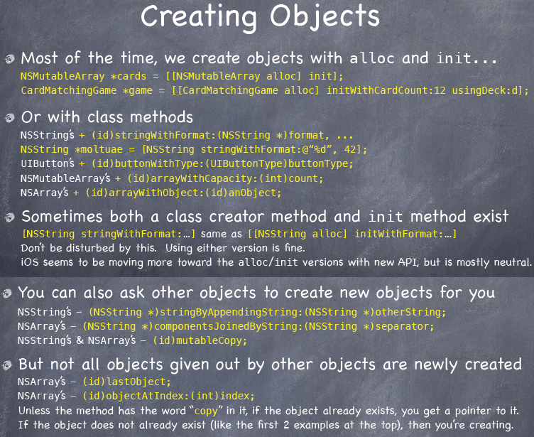
### nil ###
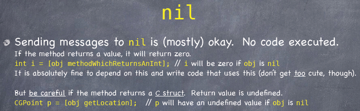

### Dynamic Binding ###
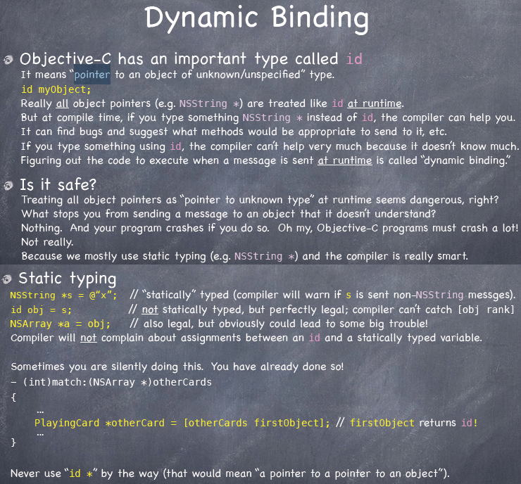

#### Object Typing ####
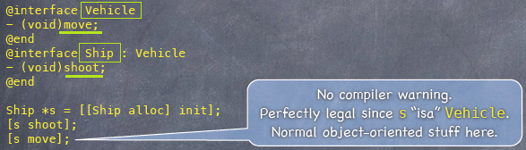
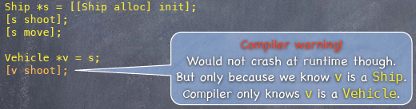
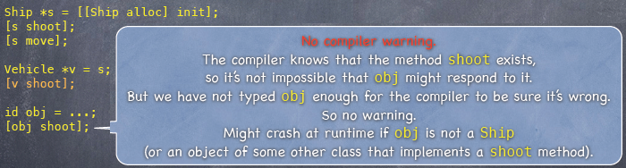
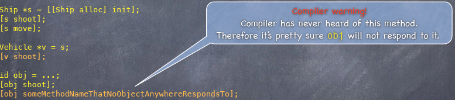
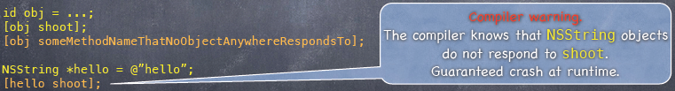
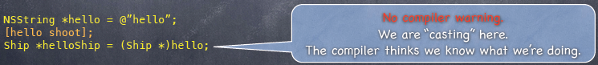
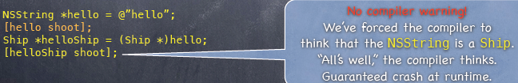
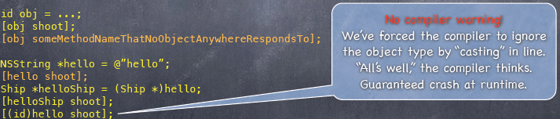

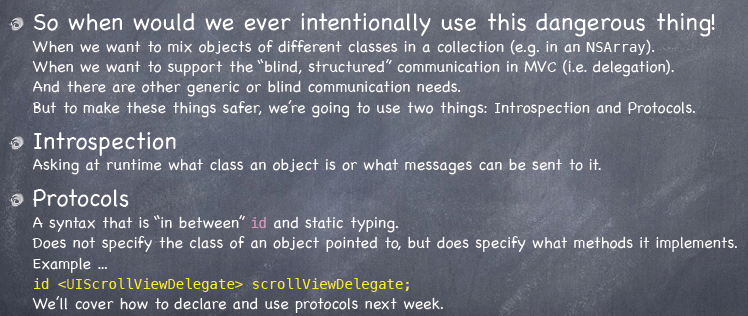
> Introspection 自省

### Introspection ###
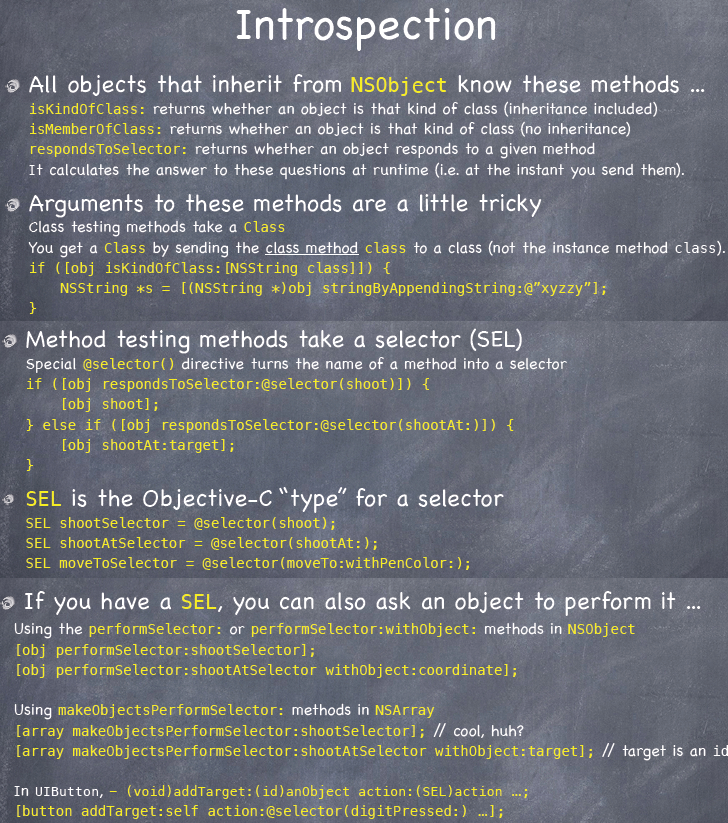

**[Index](readme.md)**