<link href="http://github.com/yrgoldteeth/darkdowncss/raw/master/darkdown.css"rel="stylesheet"></link>

# Developing Applications for iOS #
*Stanford CS193p (Fall 2013-14)*

## Lecture 5 ##
*Oct. 7th,2013*
### UI Demo ###
> **NSTextStorage** is a subclass of NSMutableAttributedString.
> You can simply modify it and the UITextView will automatically update. New in iOS 7.

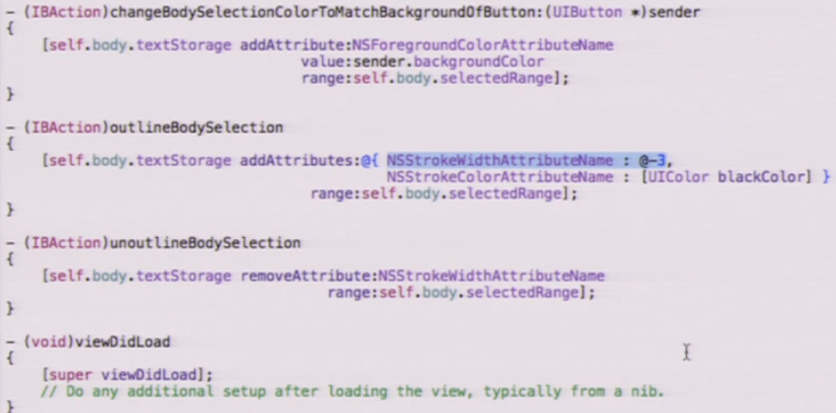

### View Controller Lifecycle ###
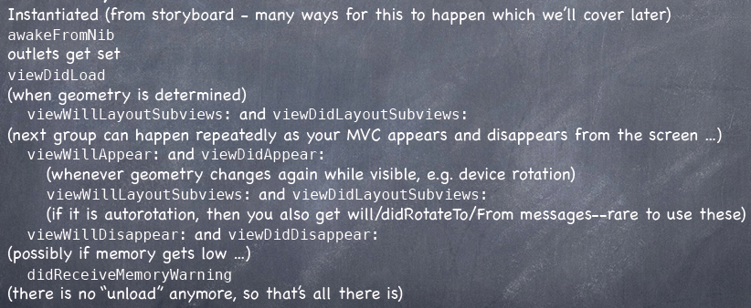

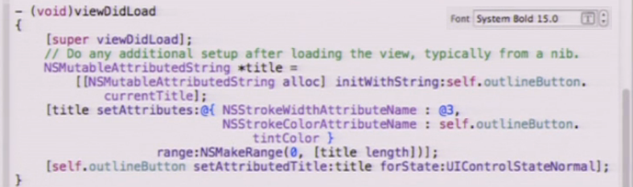

### NSNotification ###

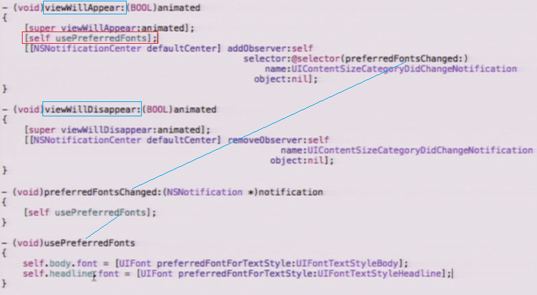

## Lecture 6 ##
*Oct. 9th,2013*

### Generic Controller ###
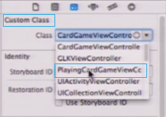

### Segues ###
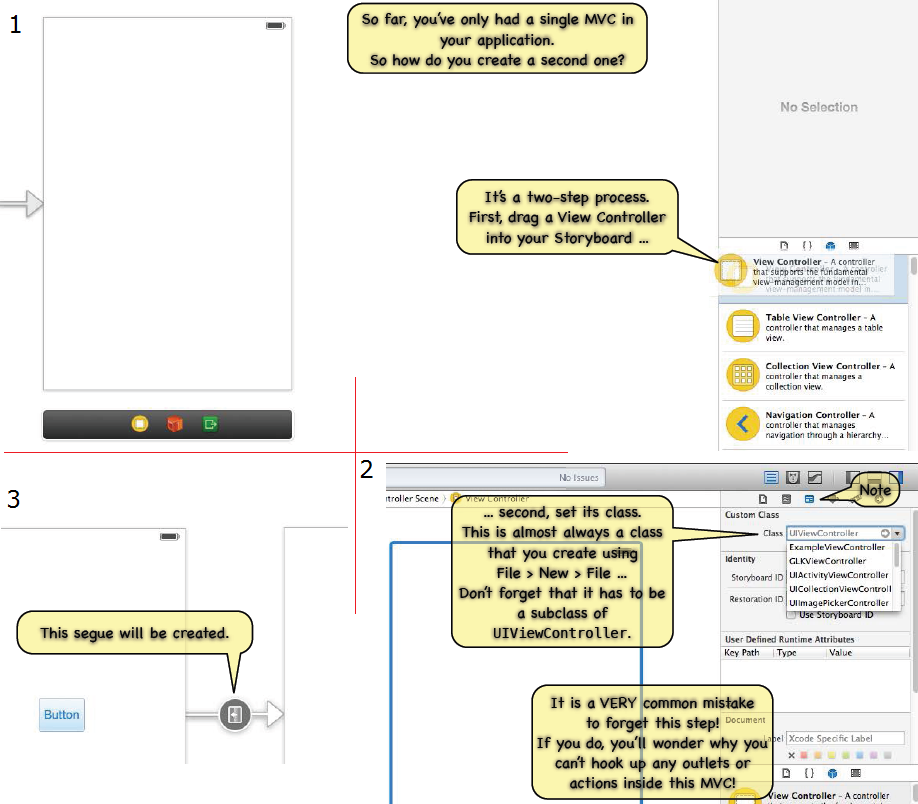

#### UINavigationController ####
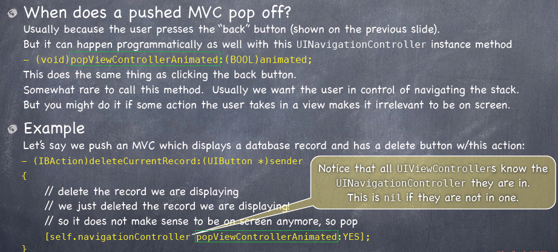
#### View Controller ####
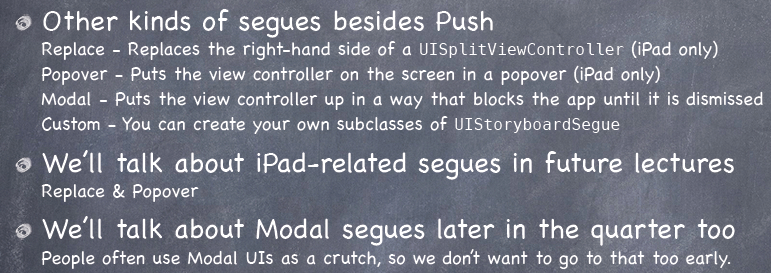

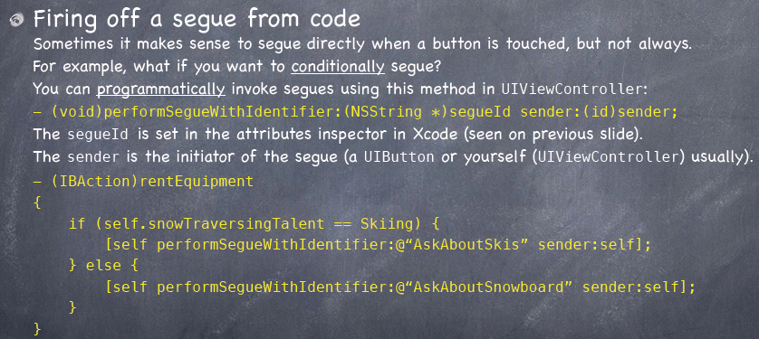

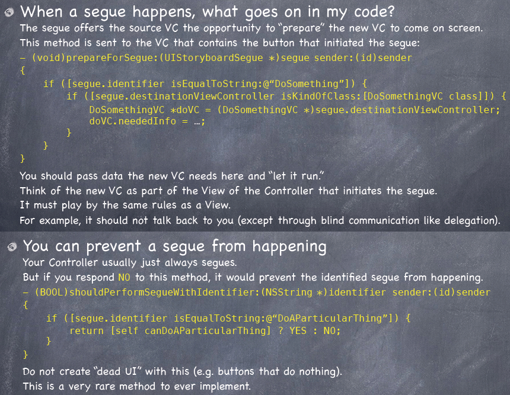

### Attributor Stats ###
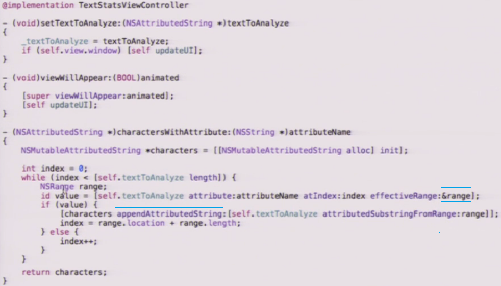

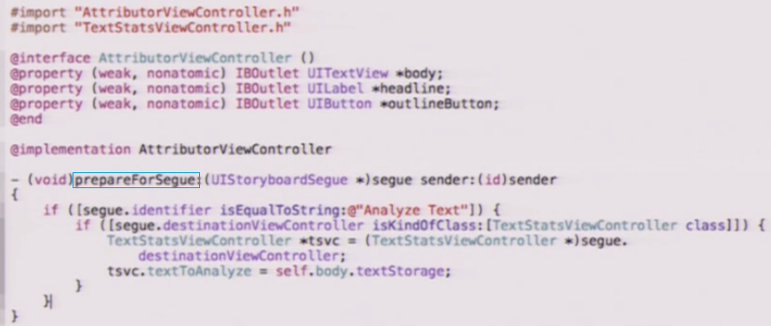

**[Index](readme.md)**