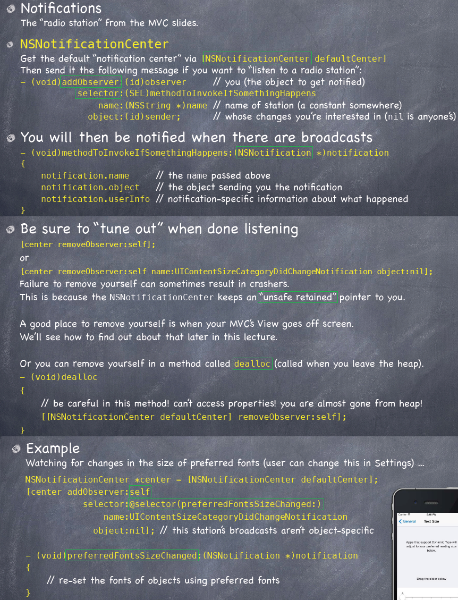

<link href="http://github.com/yrgoldteeth/darkdowncss/raw/master/darkdown.css"rel="stylesheet"></link>

# Developing Applications for iOS #
*Stanford CS193p (Fall 2013-14)*

## Lecture 5 ##
*Oct. 7th,2013*
### UI Demo ###
> **NSTextStorage** is a subclass of NSMutableAttributedString.
> You can simply modify it and the UITextView will automatically update. New in iOS 7.

### View Controller Lifecycle ###

### NSNotification ###

## Lecture 6 ##
*Oct. 9th,2013*

### Generic Controller ###

### Segues ###

#### UINavigationController ####

#### View Controller ####

### Attributor Stats ###

**[Index](readme.md)**