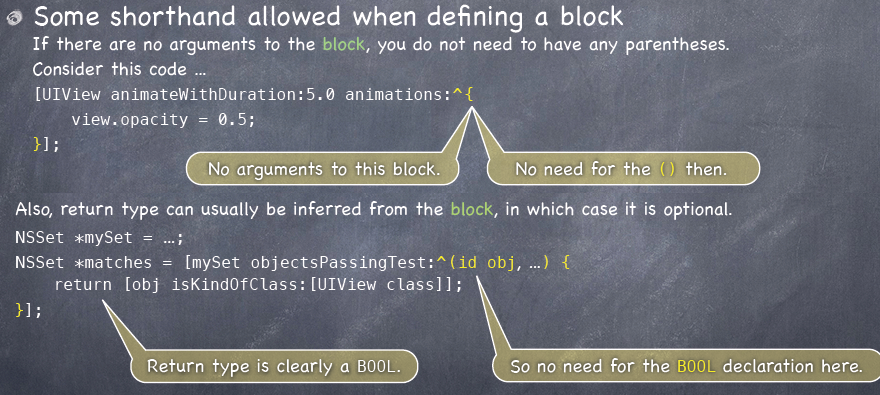
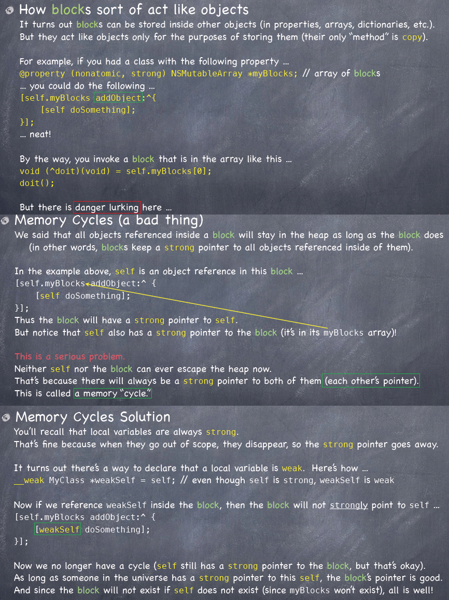
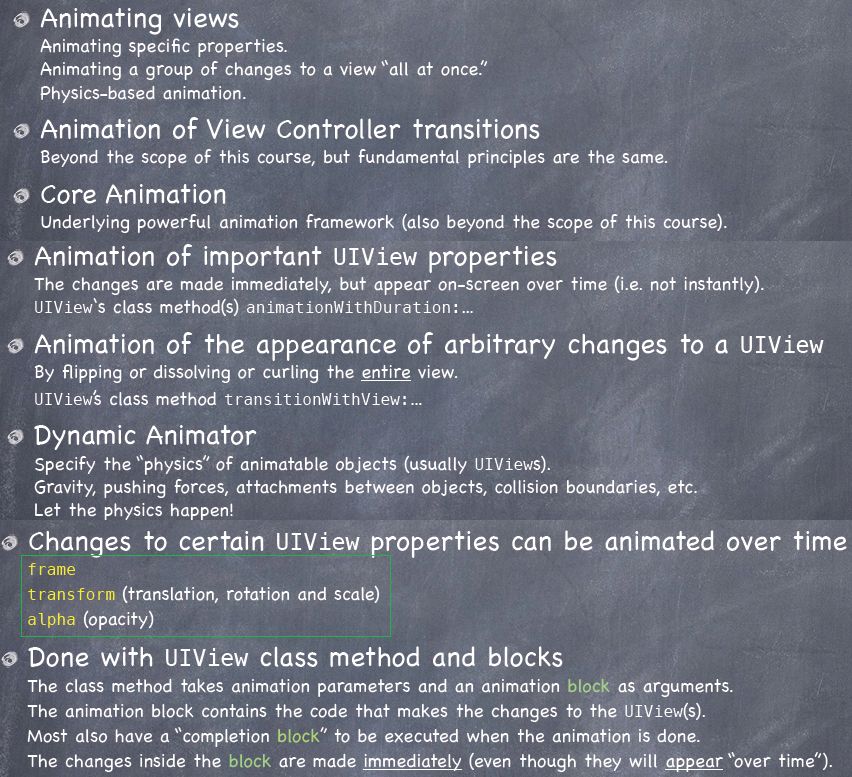

<link href="http://github.com/yrgoldteeth/darkdowncss/raw/master/darkdown.css"rel="stylesheet"></link>

# Developing Applications for iOS #
*Stanford CS193p (Fall 2013-14)*

## Lecture 7 ##
*Oct. 14th,2013*
### Views ###
#### View Coordinates ####

    CGRect labelRect = CGRectMake(20, 20, 50, 30);
    UILabel *label = [[UILabel alloc] initWithFrame:labelRect];
    label.text = @”Hello!”;
    [self.view addSubview:label]; // Note self.view!

#### Context ####

#### Graphics State ####

#### Drawing Text ####

#### Drawing Images ####

#### Redraw on bounds change? ####

### Gestures ###
#### UIGestureRecognizer ####

#### Other Concrete Gestures ####

> 捏， 旋， 戳/刷， 点

### SuperCard(demo) ###
#### PlayingCardView.h ####

#### PlayingCardView.m ####

## Lecture 8 ##
*Oct. 21th,2013*

### Protocols ###

### Blocks ###
#### A Closure ####

#### Shorthand ####

#### Storing&Memory Cycles ####

#### When To Use Block ####

#### typedef ####

### Animation ###
#### Animation ####

#### UIView Animation ####

#### Dynamic Animation ####

### Dropit(demo) ###
#### DropitViewController.m ####

#### DropitBehavior.m ####

***DropitViewController.m refactor***

## Lecture 9 ##
*Oct. 21th,2013*
### More Dropit(demo) ###
> 皮埃爾·貝茲 Pierre Bézier, 貝茲曲線 贝赛尔曲线
### Autolayout ###

Orientation:

- portrait
- landscape

> unwittingly: blue guidelines, suggested constraints.
> 
> leading space is from left
> 
> default to use its intrinsic size
> 
> dashed box 虚线框

### Autolayout Demo ###

**[Index](readme.md)**