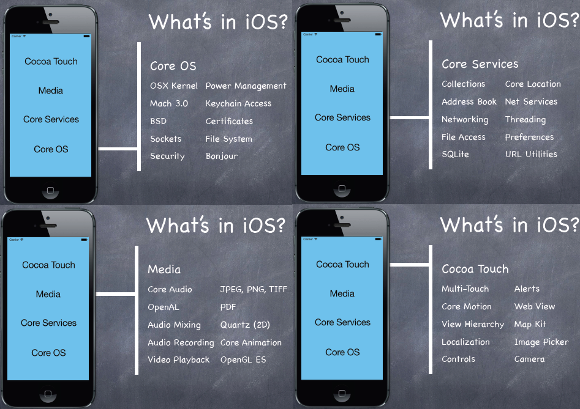
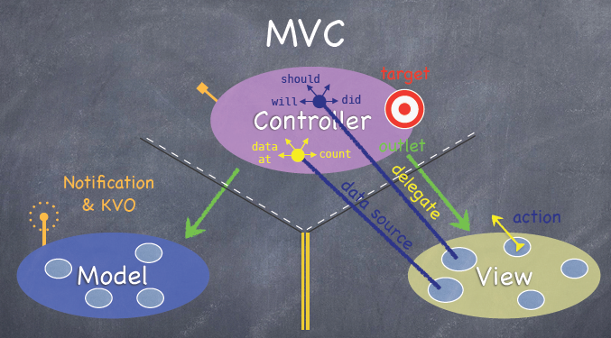
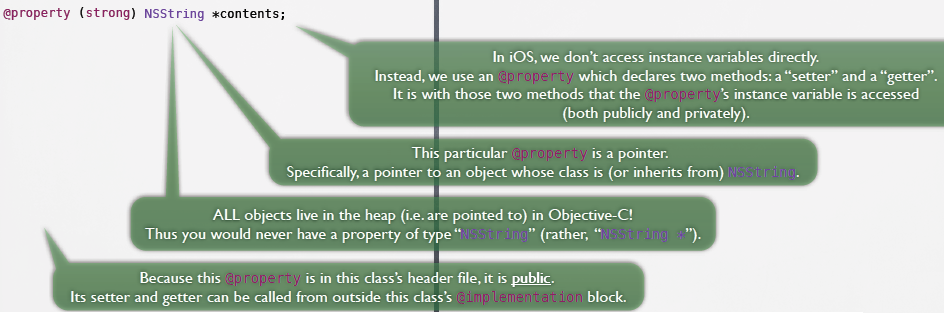
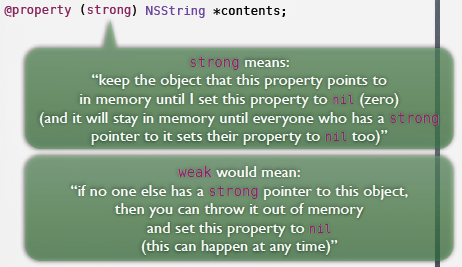
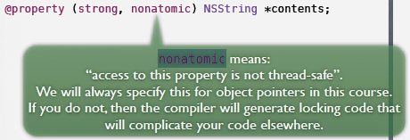
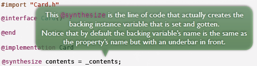
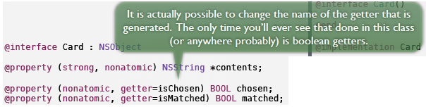
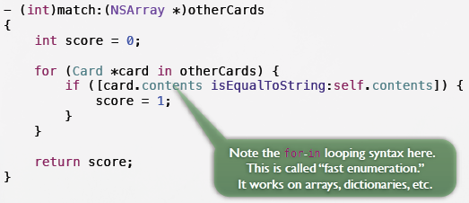

<link href="http://github.com/yrgoldteeth/darkdowncss/raw/master/darkdown.css"rel="stylesheet"></link>

# Developing Applications for iOS #
*Stanford CS193p (Fall 2013-14)*

## Lecture 1 ##
### 

###1. ios ###

###2. mvc ###

###3. Objective-C ###
- Card.h Public Declarations
- Card.m Private Implementation

> \#import <Foundation/Foundation.h\>
> 
> @import Foundation
> 
> In iOS 7 (only), there is special syntax for importing an entire framework called @import.

#### property ####

#### strong ####

#### nonatomic ####

#### synthesize ####

#### BOOL getter ####

#### method ####

