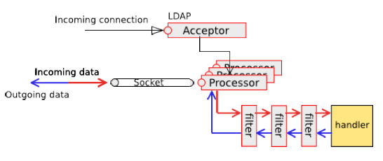

## MINA2.0.7 ##

### 基于MINA应用的架构 ###
基于TCP/IP协议,UDP/IP协议,VM管道通信,串行通信(RS-232C)RXTX 

 

### 服务器 ###

### 客户端 ###

### MINA组件 ###

#### MINA 3层组件 ####

##### - I/O Service：处理I/O操作 #####

##### - I/O Filter Chain：过滤/转换 数据和字节 #####

##### - I/O Handler：处理业务逻辑 #####
- sessionCreated
- sessionOpened
- sessionClosed
- sessionIdle
- exceptionCaught
- messageReceived
- messageSent

#### MINA 工作流 ####

### IoService ###
#### IoAcceptor ####
- NioSocketAcceptor : the non-blocking Socket transport IoAcceptor
- NioDatagramAcceptor : the non-blocking UDP transport IoAcceptor
- AprSocketAcceptor : the blocking Socket transport IoAcceptor, based on APR
- VmPipeSocketAcceptor : the in-VM IoAcceptor

#### IoConnector ####
- NioSocketConnector : the non-blocking Socket transport IoConnector
- NioDatagramConnector : the non-blocking UDP transport IoConnector
- AprSocketConnector : the blocking Socket transport IoConnector, based on APR
- ProxyConnector : a IoConnector providing proxy support
- SerialConnector : a IoConnector for a serial transport
- VmPipeConnector : the in-VM IoConnector

### Session ###
- Connected : the session has been created and is available
- Idle : the session hasn't processed any request for at least a period of time (this period is configurable)
	- Idle for read : no read has actually been made for a period of time
	- Idle for write : no write has actually been made for a period of time
	- Idle for both : no read nor write for a period of time
- Closing : the session is being closed (the remaining messages are being flushed, cleaning up is not terminated)
- Closed : The session is now closed, nothing else can be done to revive it.

### Filters ###
- Blacklist	**BlacklistFilter**	Blocks connections from blacklisted remote addresses
- Buffered Write	 **BufferedWriteFilter**	Buffers outgoing requests like the BufferedOutputStream does
- Compression	**CompressionFilter**	 
- ConnectionThrottle	 **ConnectionThrottleFilter**	 
- ErrorGenerating	**ErrorGeneratingFilter**	 
- Executor	**ExecutorFilter**	 
- FileRegionWrite	**FileRegionWriteFilter**	 
- KeepAlive	**KeepAliveFilter**	 
- Logging	**LoggingFilter**	Logs event messages, like MessageReceived, MessageSent, SessionOpened, ...
- MDC Injection	**MdcInjectionFilter**	Inject key IoSession properties into the MDC
- Noop	**NoopFilter**	A filter that does nothing. Useful for tests.
- Profiler	**ProfilerTimerFilter**	Profile event messages, like MessageReceived, MessageSent, SessionOpened, ...
- ProtocolCodec	**ProtocolCodecFilter**	A filter in charge of encoding and decoding messages
- Proxy	**ProxyFilter**	 
- Reference counting	 **ReferenceCountingFilter**	Keeps track of the number of usages of this filter
- RequestResponse	**RequestResponseFilter**	 
- SessionAttributeInitializing	**SessionAttributeInitializingFilter**	 
- StreamWrite	**StreamWriteFilter**	 
- SslFilter	**SslFilter**	 
- WriteRequest	**WriteRequestFilter**
### Transports ###
- APR Transport
- Serial Transport

### State Machine ###

[Source code](git clone http://git-wip-us.apache.org/repos/asf/mina.git mina)
[MINA user guide](http://mina.apache.org/mina-project/userguide/user-guide-toc.html)