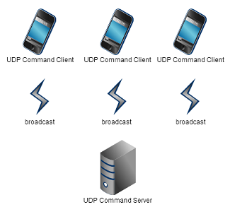
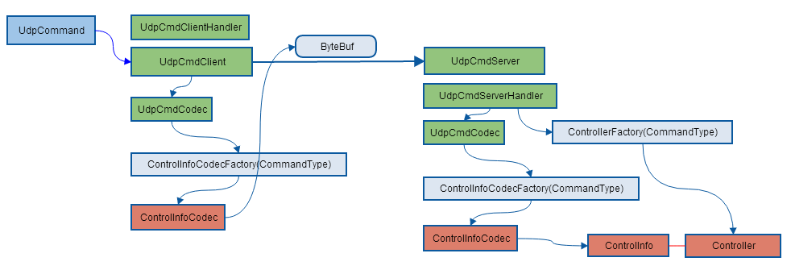
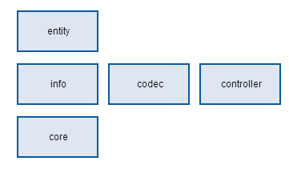
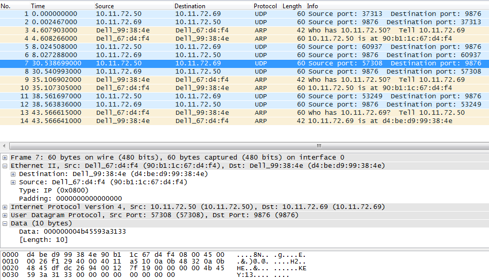

#UDP Command Design#
- build:gradle-1.10
- dependency:netty5.0.0.Alpha1

### network topology ###
One UDP Command Server receiving Clients' sending or broadcasting message via UDP nio Channel.
When UDP Command Server receives command, it will choose a related controller to process this command.
 

### how does it work ###

### class organization ###
Firstly, it's an abstract existing to encapsulate the UDP Commands, it's blind to acknowledge what kind of and how many commands in the implementation application. So, the command detail info is located in **info package**, it's networking codec is in **codec package** and it's handler in **controller package**.And **core package** is for nio networking which is a netty-based implementation. **entity package** is for UDP command itself.
 

So, for fixable and extensible, to provide type for command and use factory design pattern for codec and controller. 

To extend for a new command type, it should generate info, codec and controller, while to extend the factory method.

	├── codec
	│   ├── ControlInfoCodecFactory.java
	│   ├── ControlInfoCodec.java
	│   └── KeyControlInfoCodec.java
	├── controller
	│   ├── ControllerFactory.java
	│   ├── Controller.java
	│   └── KeyController.java
	├── core
	│   ├── UdpCmdClientHandler.java
	│   ├── UdpCmdClient.java
	│   ├── UdpCmdCodec.java
	│   ├── UdpCmdServerHandler.java
	│   └── UdpCmdServer.java
	├── entity
	│   ├── CommandType.java
	│   └── UdpCommand.java
	└── info
	    ├── ControlInfo.java
	    └── KeyControlInfo.java

### Command structure ###
UDP Command has two fields, the type is used to generate the codec and controller in the factory method, and the info is the command detail info for controller processing.

	public class UdpCommand implements Serializable {
	    private CommandType type;
	    private ControlInfo controlInfo;

###Key Command Implementation###
#### info ####

	public class KeyControlInfo implements ControlInfo {
	    private String keyPress;
#### codec ####

	public class KeyControlInfoCodec implements ControlInfoCodec {
	    KeyControlInfoCodec() {
	    }
	
	    @Override
	    public byte[] encode(ControlInfo controlInfo) {
	        KeyControlInfo keyControlInfo = (KeyControlInfo) controlInfo;
	        return keyControlInfo.getKeyPress().getBytes();
	    }
	
	    @Override
	    public ControlInfo decode(byte[] buf) {
	        KeyControlInfo keyControlInfo = new KeyControlInfo();
	        keyControlInfo.setKeyPress(new String(buf));
	        return keyControlInfo;
	    }
	}

#### controller ####

	public class KeyController implements Controller {
	    private final static Logger logger = LogManager.getLogger(KeyController.class);
	
	    KeyController() {
	
	    }
	
	    @Override
	    public void process(ControlInfo controlInfo) {
	        KeyControlInfo keyControlInfo = (KeyControlInfo) controlInfo;
	        logger.debug("KEY Press is:{}", keyControlInfo.getKeyPress());
	        //......
	    }
	}

##Test##

    2014-02-12 11:55:46,938 [o.f.a.i.n.n.u.c.KeyCommandTest] Test Send Command
    2014-02-12 11:55:47,231 [o.f.a.i.n.n.u.c.c.UdpCmdServer] UDP Command Server launched.
    2014-02-12 11:55:47,246 [o.f.a.i.n.n.u.c.c.UdpCmdClient] UDP Command[KEY-KEY:13] has been send.
    2014-02-12 11:55:47,246 [o.f.a.i.n.n.u.c.c.UdpCmdServerHandler] DatagramPacket:DatagramPacket(/127.0.0.1:64111 => /0.0.0.0:9159, SimpleLeakAwareByteBuf(UnpooledUnsafeDirectByteBuf(ridx: 0, widx: 10, cap: 2048)))
    2014-02-12 11:55:47,247 [o.f.a.i.n.n.u.c.c.UdpCmdClient] UDP Command[KEY-KEY:13] channel closed.
    2014-02-12 11:55:47,247 [o.f.a.i.n.n.u.c.c.UdpCmdServerHandler] UDP Command Client response:KEY-KEY:13
    2014-02-12 11:55:47,249 [o.f.a.i.n.n.u.c.c.KeyController] KEY Press is:KEY:13
    2014-02-12 11:55:47,260 [o.f.a.i.n.n.u.c.c.UdpCmdClient] UDP Command[KEY-KEY:10] has been send.
    2014-02-12 11:55:47,260 [o.f.a.i.n.n.u.c.c.UdpCmdServerHandler] DatagramPacket:DatagramPacket(/127.0.0.1:64112 => /0.0.0.0:9159, UnpooledUnsafeDirectByteBuf(ridx: 0, widx: 10, cap: 2048))
    2014-02-12 11:55:47,261 [o.f.a.i.n.n.u.c.c.UdpCmdServerHandler] UDP Command Client response:KEY-KEY:10
    2014-02-12 11:55:47,261 [o.f.a.i.n.n.u.c.c.UdpCmdClient] UDP Command[KEY-KEY:10] channel closed.
    2014-02-12 11:55:47,261 [o.f.a.i.n.n.u.c.c.KeyController] KEY Press is:KEY:10

	Process finished with exit code 0

##Remote Test##
- **Server: 10.11.72.69**
- **Client: 10.11.72.50**
- **UDP port: 9876**

