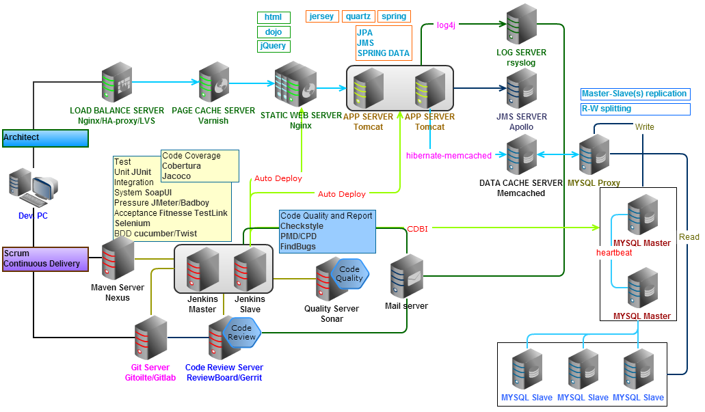
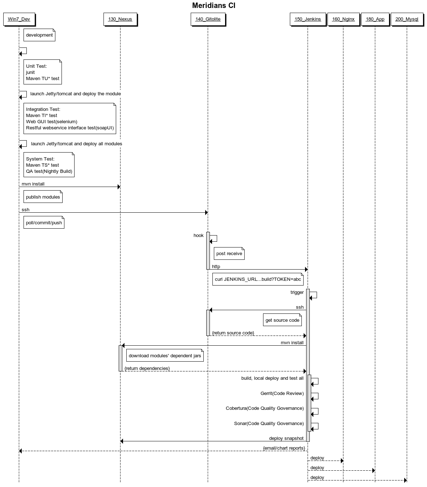

[MERIDIANS](http://github.com/feuyeux/meridians)
#
	PLAN NAME(计划名称)
		CI meridians(持续集成子午线)
	LAUNCHED FROM(开始时间)
		2013.1.13
	PLAN GOAL(计划目的)
		install and deploy the Architect & CI VM environment
		(完成Architect和CI虚拟机的安装和部署)
##Servers Topology

##Meridians Server
| NAME | TYPE | IP | HOSTNAME | OS | CORE VERSION | OTHERS VERSION |
|:--|:--|:--|:--|:--|--:|--:|
|1 Maven SERVER|C|192.168.0.130|meridians-nexus|U|Sonatype Nexus 2.3.0-04|-|
|2 Git SERVER|C|192.168.0.140|meridians-gitolite|U|gitolite3 v3.3-10-g293df79|git 1.7.10.4 gitweb 1.7.10.4 cgit 0.9.0.3 highlight 3.9-1|
|3 Git SERVER|C|192.168.0.141|meridians-gitlab|M|?|?|
|4 CI SERVER|C|192.168.0.150|meridians-jenkins-master|U|jenkins-war 1.500|-|
|5 CI SERVER|C|192.168.0.151|meridians-jenkins-slaver|U|jenkins-war 1.500|-|
|6 CODE QUALITY|C|192.168.0.159|meridians-sonar|U|sonar 3.4.1|-|
|7 CODE REVIEW|C|192.168.0.149|meridians-gerrit|U|Gerrit 2.5.2|-|
|8 CODE REVIEW|C|192.168.0.?|meridians-reviewboard|U|?|-|
|9 MAIL SERVER|C|192.168.0.155|meridians-mail|R|?|-|
|1 LOAD BALANCE|A|192.168.0.150|meridians-nginx|U|nginx/1.3.11|gcc 4.7.2 pcre-8.21 zlib-1.2.7 nginx-http-concat|
|2 PAGE CACHE|A|192.168.0.170|meridians-varnish|U|varnish-cache-3.0.3|-|
|3 STATIC SERVER|A|192.168.0.160|meridians-nginx|U|nginx/1.3.11|gcc 4.7.2 pcre-8.21 zlib-1.2.7 nginx-http-concat|
|4 APP SERVER|A|192.168.0.180|meridians-app|U|?|-|
|5 APP SERVER|A|192.168.0.181|meridians-app2|R|?|-|
|6 MESSAGE QUEUE|A|192.168.0.188|meridians-message|R|apollo-1.6|-|
|7 LOG SERVER|A|192.168.0.185|meridians-rsyslog|R|rsyslog 7.2.6|loganalyzer 3.6.3|
|8 DATA CACHE|A|192.168.0.190|meridians-memcached|R|memcached-1.4.15|libevent-2.0.21|
|8.1 DATA SERVER|A|192.168.0.192|meridians-redis|R|redis-2.6.11|-|
|8.2 DATA SERVER|A|192.168.0.194|meridians-mongodb|R|mongodb-2.4.1|-|
|8.3 DATA SERVER|A|192.168.0.196|meridians-cassandra|R|apache-cassandra-1.2.3|-|
|8.4 DATA SERVER|A|192.168.0.198|meridians-mapreduce|R|hadoop-1.1.2|-|
|9 DATABASE|A|192.168.0.200|meridians-mysql-master|U|mysql 5.5.29|-|
|10 DATABASE|A|192.168.0.201|meridians-mysql-slaver|R|?|-|
|11 DATABASE|A|192.168.0.202|meridians-mysql-proxy|U|mysql-proxy 0.8.1|glib2.30.1 libevent2.0.19 Lua5.1.4|
#
	O Operation System(操作系统)
		U -- Ubuntu 12.10 server
		M -- Linux Mint 14
		R -- CentOS-6.3-x86_64
	T Type(类别)
		C -- 敏捷/持续集成
		A -- 架构
	Accounts(帐号)
		OS:eric/han
		CentOS:root/erichan;eric/han
		database:root/root
#
	Generic step(通用步骤)
	    Copy from general vm(拷贝基础虚拟机)
	    networking and host settings(network和host配置)
	    ssh configuration(ssh配置)
	    specific software installation and configuration( SERVER软件安装和配置)	

http://www.sublimetext.com/2
http://markdownpad.com

##CI/CD pipeline(持续集成/持续部署流程)
