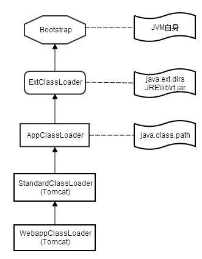
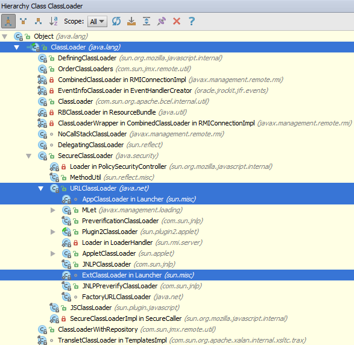

# ClassLoader #

## 等级层次 ##

ClassLoader加载类用的是委托模型。即先让Parent类(而不是Super，不是继承关系)寻找，Parent找不到才自己找。

## 类层次 ##

## 加载字节码到内存 ##

(TODO openJDK8)
- findClass
- defineClass
- resolveClass
- loadClass

- findLoadedClass

## 热部署 reload ##
使用不同的ClassLoader实例加载同名的类

# 显式加载一个类 #

- Class.forName
- ClassLoader.loadClass
- ClassLoader.finSystemClass

Class.forName("XXX.XXX");
等同于Class.forName("XXX.XXX", true, CALLCLASS.class.getClassLoader());第二个参数表示装载类的时候是否初始化该类，即调用类的静态块的语句及初始化静态成员变量。

ClassLoader cl = Thread.currentThread().getContextClassLoader();
Class clazz = cl.loadClass("XXX.XXX");
没有指定是否初始化的选项。只有执行clazz.newInstance();时才初始化类。
与Class.forName("XXX.XXX", false, cl)执行过程是一致的。